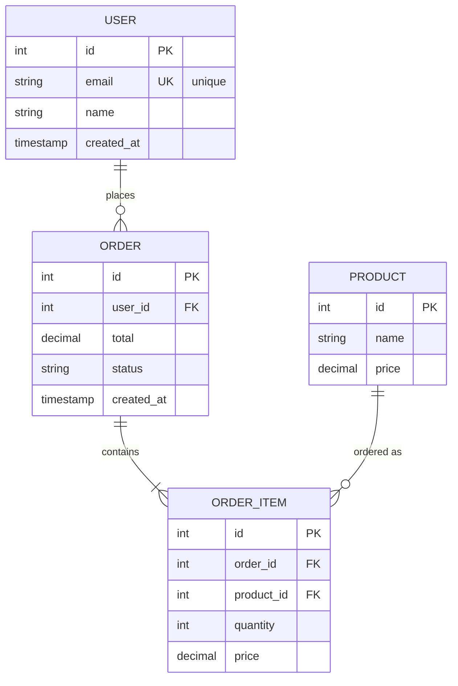

When we onboarded our last batch of contractors, we asked each of them to walk us through how they design a new database table. Five out of six described the same workflow we use: write the migration, run it, generate the ER diagram from the resulting schema, commit the diagram. Zero started with a hand-drawn ERD on a whiteboard. The sixth one had been doing it the textbook way and switched mid-sprint when she saw how much faster the rest of us shipped.

We've been running schema-first for about three years now. The ER diagram still exists, it's just downstream — generated from `CREATE TABLE` statements, committed alongside the migration, automatically updated on every schema change. Below is the workflow we settled on, what we tried before, and the cases where we still draw the diagram first.

## When to draw the ERD first

The diagram-first approach (sometimes called "data modeling") is still right for:

- **Greenfield database** with complex domain logic, finance, healthcare, e-commerce with many entities.
- **Early-stage product** where requirements are unclear and visualizing helps stakeholders argue.
- **Migrating from another system**: the source schema is already an ERD, you redesign on paper.
- **Educational settings** where you're learning normalization.

For these, draw on a whiteboard or in [Mermaid Diagram Creator](/misc-tools/diagram-creator/) using the `erDiagram` syntax. Iterate, then translate to SQL.

## When to write SQL first

For most teams, most of the time:

- **Adding to an existing schema**: there are already 50 tables; you're adding a new feature.
- **Microservices** with small per-service databases, typically 5-10 tables, easy to keep in your head.
- **Schema migrations**: you're writing migrations directly anyway, the migration files **are** the source of truth.
- **ORM-defined schemas**: Prisma, Drizzle, TypeORM — the schema is in code; the SQL is generated.

In these cases, drawing first adds friction. Write the migration, generate a diagram for documentation.

## The "generate from schema" workflow

The minimal workflow:

1. Write `CREATE TABLE` statements (or generate from your ORM)
2. Paste into a tool that produces an ER diagram
3. Review the diagram for relationships you missed or designed badly
4. Commit the diagram alongside the schema

[ERD Diagram](/dotnet-tools/erd-diagram/) does step 2 in your browser. Paste:

```sql
CREATE TABLE users (
    id INT PRIMARY KEY AUTO_INCREMENT,
    email VARCHAR(255) UNIQUE NOT NULL,
    name VARCHAR(100),
    created_at TIMESTAMP DEFAULT CURRENT_TIMESTAMP
);

CREATE TABLE orders (
    id INT PRIMARY KEY AUTO_INCREMENT,
    user_id INT NOT NULL,
    total DECIMAL(10, 2),
    status VARCHAR(20),
    created_at TIMESTAMP DEFAULT CURRENT_TIMESTAMP,
    FOREIGN KEY (user_id) REFERENCES users(id)
);

CREATE TABLE order_items (
    id INT PRIMARY KEY AUTO_INCREMENT,
    order_id INT NOT NULL,
    product_id INT NOT NULL,
    quantity INT NOT NULL,
    price DECIMAL(10, 2),
    FOREIGN KEY (order_id) REFERENCES orders(id) ON DELETE CASCADE,
    FOREIGN KEY (product_id) REFERENCES products(id)
);
```

Get an interactive diagram with arrows showing FK relationships. Drag tables around, export as SVG or copy as Mermaid.

## What a good auto-generated ERD shows

A useful generated diagram should:

- **Group related tables visually**: users + orders + order_items should cluster, not scatter.
- **Show cardinality**: one-to-many vs many-to-many.
- **Indicate primary and foreign keys**: usually with PK / FK markers.
- **Distinguish nullable vs required FKs**: a NOT NULL FK is a required relationship.

What it usually doesn't show, and what you should add by hand:

- **Soft-delete columns** (e.g., `deleted_at`) and what they imply for queries.
- **Domain meaning**: "this enum is the order status state machine."
- **Performance hints**: which columns are indexed, which queries are hot.
- **Cross-database relationships**: foreign keys to tables in other services.

For these, supplement the auto-generated diagram with notes or a separate "data dictionary" document.

## ER diagram syntax in Mermaid

If you want the ERD as code (committable, version-controlled):



Cardinality notation:

- `||--||`, exactly one to exactly one
- `||--o{`, exactly one to zero-or-more (the most common)
- `||--|{`, exactly one to one-or-more
- `}o--o{`, zero-or-more to zero-or-more (junction table)

The advantage of Mermaid ERDs over screenshot-style diagrams: it's text. Diff-friendly, git-friendly, AI-friendly.

## When auto-generation falls down

A few cases where generated diagrams mislead:

### Implicit relationships

If you have a `posts.author_id` column without a foreign key constraint (some teams skip FKs for performance), the generator can't know it's a relationship. You'll get two disconnected tables in the diagram.

Fix: add the FK constraint (recommended), or annotate the diagram by hand.

### Polymorphic associations

```sql
-- One column references multiple tables based on type
CREATE TABLE comments (
    id INT PRIMARY KEY,
    commentable_type VARCHAR(50),  -- 'post' or 'photo'
    commentable_id INT
);
```

ER diagram tools can't represent this. The relationship is conditional on the `_type` field. Polymorphism is hard to draw; document it as text alongside the diagram.

### Many-to-many through a table

A junction table (e.g., `user_roles`) shows up as two one-to-many relationships. Some tools collapse this into a single `users-many-many-roles` arrow; others show all three tables. Both are valid; pick whichever is clearer for your audience.

### NoSQL embedded documents

ER is for relational. If your schema has `user.preferences` as a nested JSON document, ER doesn't capture it. For NoSQL, schema visualization tools like Studio 3T (MongoDB) are more appropriate.

## Keeping diagrams in sync with schema

The biggest problem with documentation diagrams: they go stale. The schema changes, the diagram doesn't, three months later it lies.

Approaches that help:

### 1. Generate on every migration

Add a step to your migration tooling:

```bash
# After running migrations
dump_schema.sh > schema.sql
generate_erd schema.sql > docs/erd.mermaid
git add docs/erd.mermaid
```

Now the diagram is in your PRs. Reviewers see schema diffs alongside diagram diffs.

### 2. Generate on demand from CI

A CI job that builds the docs site can generate the ERD fresh from the production-equivalent schema. The diagram is never stale because it's always rebuilt.

### 3. Use a code-first ORM

Prisma's schema file IS the source of truth, AND it visualizes nicely:

```prisma
model User {
  id        Int      @id @default(autoincrement())
  email     String   @unique
  orders    Order[]
}

model Order {
  id      Int   @id @default(autoincrement())
  userId  Int
  user    User  @relation(fields: [userId], references: [id])
  total   Decimal
}
```

Prisma's `prisma generate` produces both the migration AND can output ERDs via `prisma-erd-generator`. The schema file is short, readable, and a single source of truth.

## The diagram for stakeholders vs the diagram for engineers

The "complete" ERD has every column, every constraint. It's overwhelming for non-engineers.

For stakeholder communication, draw a simplified version:

```
    Customer ── places ──> Order ── contains ──> OrderItem
       │                                              │
       │                                              ├── Product
       │
       └── has ──> Address
```

Tables only, key relationships only. Save the full ERD for engineering docs.

## Recommended workflow

1. **For new schemas**: write SQL migrations directly. Generate diagrams from the result.
2. **For ad-hoc visualization**: paste schema into [ERD Diagram](/dotnet-tools/erd-diagram/), interactive, drag-friendly.
3. **For repo-bound docs**: Mermaid `erDiagram` syntax. Commit alongside migrations.
4. **For ORM-managed schemas**: use the ORM's diagram generator (`prisma-erd-generator`, `dbml-renderer`).
5. **For stakeholder communication**: draw a simplified version by hand. Don't show them the 30-table production ERD.

The principle: diagrams are most valuable when they're cheap to keep current. Auto-generation makes that possible. Hand-drawn diagrams are still useful, but only as supplements, not primary documentation.

---

**Related tools on DevTools Online:**

- [ERD Diagram](/dotnet-tools/erd-diagram/), paste SQL, see ERD
- [SQL Formatter](/formatter-tools/sql-formatter/), format your CREATE TABLE before pasting
- [Mermaid Diagram Creator](/misc-tools/diagram-creator/), for hand-edited ERDs
- [SQL Plan Viewer](/dotnet-tools/sql-plan-viewer/), for query optimization on the same schema
