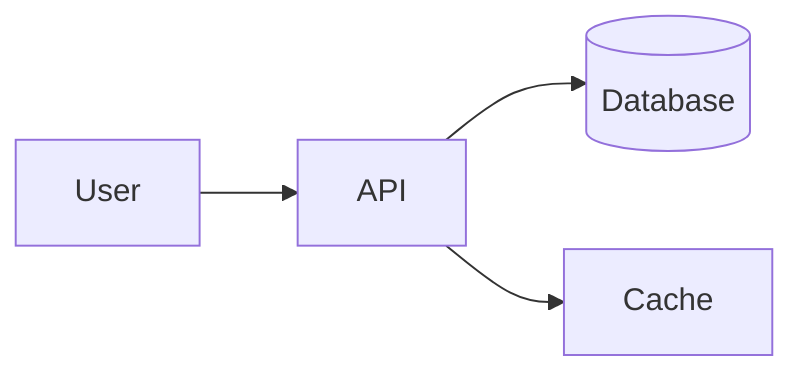
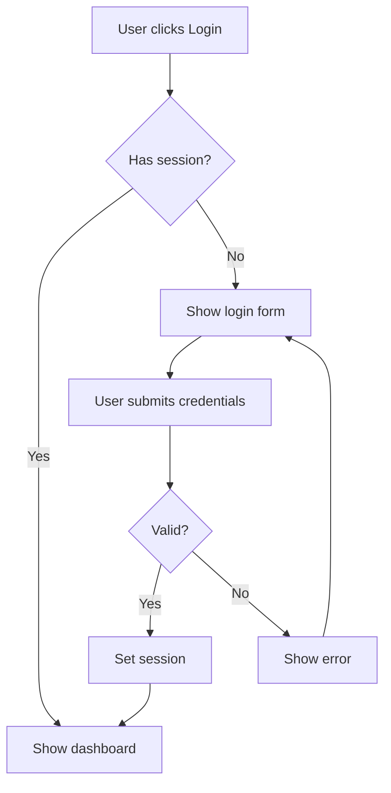
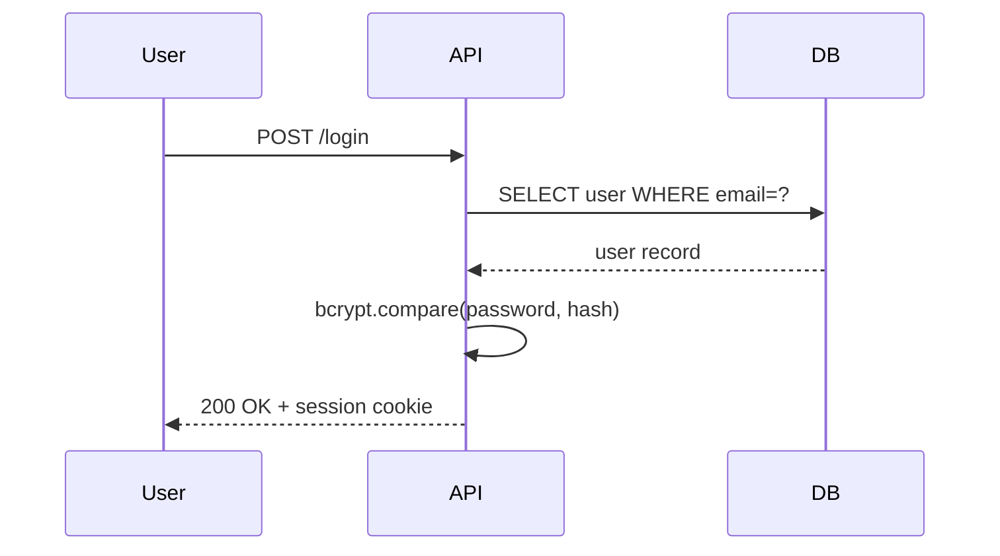
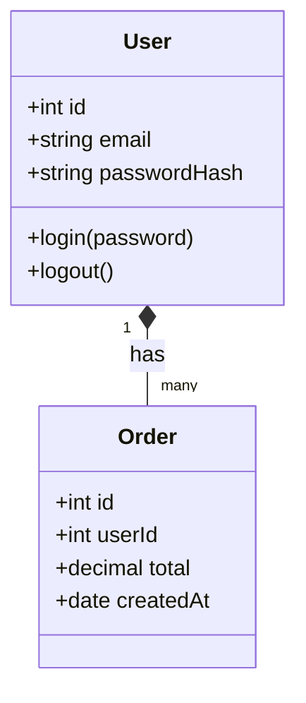
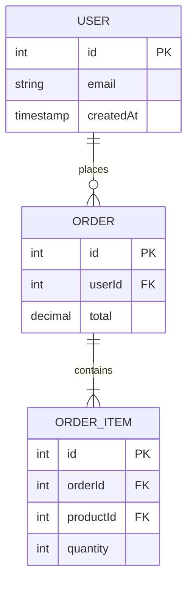
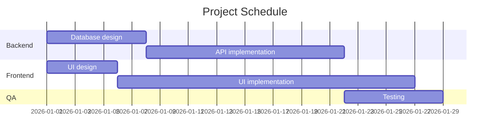
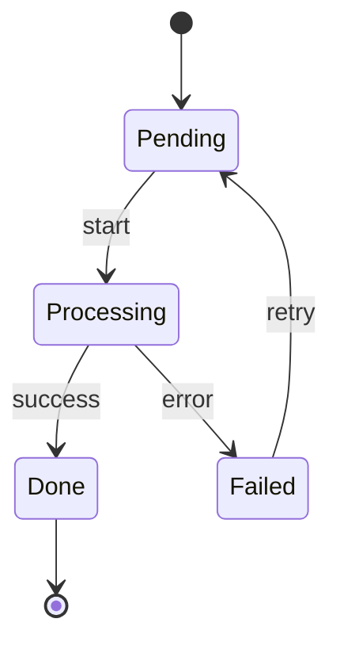
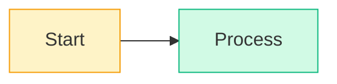

A senior engineer at the company I joined in 2021 had spent twelve years drawing system diagrams in OmniGraffle, exporting them as PNGs, dropping them into Confluence, and watching them go stale within a month. He'd ask new joiners to "look at the architecture diagram" and we'd open the wiki and find a `system-v3-FINAL-REAL.png` from 2018, a `system-v4.png` from 2019, and three Slack messages of "is this still right?".

The afternoon I showed him how Mermaid's text-based diagrams render automatically in GitHub PRs, he sent me a one-line message: "Why didn't anyone tell me this five years ago." Diagrams-as-code is one of those things that sounds gimmicky and turns out to be quietly transformative once your team adopts it. This is the on-ramp.

## What Mermaid is

Mermaid is a JavaScript library that takes a text description and renders it as an SVG diagram. The syntax was designed to be readable in raw form:



That fenced code block, with `mermaid` as the language, renders as an actual diagram on GitHub, GitLab, Notion, Obsidian, MkDocs, Docusaurus, and most modern markdown environments.

Try it: paste any of the code blocks in this post into [Mermaid Diagram Creator](/misc-tools/diagram-creator/) for a live preview.

## The diagram types you'll actually use

### 1. Flowchart, the workhorse



Use for: process flows, decision trees, control flow.

Direction: `TD` (top-down), `LR` (left-right), `BT` (bottom-top), `RL` (right-left). LR for wide processes, TD for ones with branching.

Node shapes:
- `[Square]`, process / step
- `(Rounded)`, start / end
- `((Circle))`, special (often: start)
- `{Diamond}`, decision
- `[(Database)]`, database
- `>Flag]`, banner / note
- `[/Parallelogram/]`, input/output

### 2. Sequence diagram, for API flows



Use for: showing how multiple services or actors interact over time. Especially good for:

- OAuth / authentication flows
- Async event sequences
- Distributed transactions
- Bug reports ("here's what happened in order")

Arrow syntax:
- `->>`, solid line (request)
- `-->>`, dashed line (response)
- `->>+`, activate the recipient
- `->>-`, deactivate

### 3. Class diagram, for type relationships



Use for: showing entity relationships, especially in OOP code or domain models. The `*--` is composition; `o--` is aggregation; `<|--` is inheritance.

### 4. ER diagram, for database schemas



Use for: documenting database schemas. Cardinalities:
- `||`, exactly one
- `o|`, zero or one
- `o{`, zero or more
- `|{`, one or more

For larger schemas, [ERD Diagram](/dotnet-tools/erd-diagram/) generates from your `CREATE TABLE` SQL, paste your schema, get a Mermaid-compatible diagram.

### 5. Gantt, for timelines



Use for: project schedules. Less commonly used than the others; if you're doing serious project management, dedicated tools are better.

### 6. State diagram, for finite state machines



Use for: order workflows, deployment pipelines, anything with explicit states.

## When to use which

| Situation | Diagram type |
|---|---|
| "How does this feature flow?" | Flowchart |
| "How do these services talk?" | Sequence |
| "What does the data model look like?" | ER (or Class) |
| "What states can this object be in?" | State |
| "When are these tasks happening?" | Gantt |

If you're not sure, start with a flowchart. Most things look like flows.

## The gotchas

### Special characters in labels

Parentheses, slashes, and quotes break Mermaid parsers:

```
A[User (admin)] --> B  // ❌ parens break syntax
A["User (admin)"] --> B  // ✅ wrap in quotes
```

Wrap any label with special characters in double quotes.

### Long labels

Labels that exceed ~30 chars get cramped. Use `<br>` for line breaks:

```
A["First line<br>Second line"] --> B
```

Or split a long step into multiple nodes.

### Direction for crowded diagrams

`graph TD` (top-down) is the default but produces tall narrow diagrams. For wide flows with many parallel branches, `graph LR` (left-right) is usually clearer.

### Colors and styling

Default styling is fine for most cases. To customize:



But: if you find yourself styling extensively, the diagram is probably trying to do too much. Split it.

### Versioning

Mermaid syntax has evolved. `graph` is the older keyword; modern syntax is `flowchart`. Both work. Some specific features (like the `stateDiagram-v2` you saw above) require explicit version markers.

## Tooling

### GitHub / GitLab

Both render Mermaid in markdown out of the box since 2022. No setup. Just use `\`\`\`mermaid` code fences.

### Documentation generators

- **MkDocs**: install `pymdown-extensions`, enable `pymdownx.superfences` with the Mermaid config.
- **Docusaurus**: built-in support since v2.
- **VitePress**: built-in support.
- **Notion**: supported, with `/code` block then `mermaid` language.
- **Obsidian**: supported, with `\`\`\`mermaid` code blocks.

### Live editing

For drafting, render as you type:

- [Mermaid Diagram Creator](/misc-tools/diagram-creator/). DevTools Online's editor with live preview
- `mermaid.live`, official online editor

For repo-bound diagrams: just commit the markdown, GitHub renders it on the file view.

## Mermaid limitations

Mermaid is great for medium-complexity diagrams. It's not so great for:

- **Very large diagrams**: auto-layout falls apart at 50+ nodes. Subdivide.
- **Pixel-perfect placement**: you can't say "put this node in this exact position." If you need precision, use a real diagramming tool (Excalidraw, Figma, Diagrams.net).
- **Custom shapes / icons**: limited compared to drawing tools.
- **Complex hierarchies**: nested clusters work but get unwieldy.

For these, drop down to:

- **Excalidraw**: for sketchy, hand-drawn-feel diagrams. Has its own JSON format that's still text-based and version-controllable.
- **Diagrams.net (drawio)**: full diagramming tool, exports SVG you can commit.
- **PlantUML**: Mermaid's older sibling, more diagram types, requires a Java renderer.

Mermaid hits the sweet spot for "diagram in a README." For "diagram in a 50-page architecture doc," PlantUML or proper drawing tools win.

## Recommended workflow

1. **Default for README and docs**: Mermaid. Version-controlled, GitHub-rendered.
2. **For sequence flows**: prefer `sequenceDiagram`, much clearer than a flowchart for the same content.
3. **For database docs**: paste schema into [ERD Diagram](/dotnet-tools/erd-diagram/) for the initial diagram, edit Mermaid output by hand for clarity.
4. **For ad-hoc**: live-preview in [Mermaid Diagram Creator](/misc-tools/diagram-creator/).
5. **For more complex layouts**: drop to Excalidraw or drawio. Don't fight Mermaid's auto-layout.

The bigger point: diagrams in code are reviewable, diff-able, and easier to keep updated. Image attachments in docs go stale; Mermaid diagrams next to the code they describe stay current.

---

**Related tools on DevTools Online:**

- [Mermaid Diagram Creator](/misc-tools/diagram-creator/), live editor with preview
- [ERD Diagram](/dotnet-tools/erd-diagram/), schema → Mermaid ER diagram
- [SQL Formatter](/formatter-tools/sql-formatter/), for SQL referenced in your diagrams
- [Markdown Preview](/formatter-tools/markdown-preview/), preview docs with Mermaid
